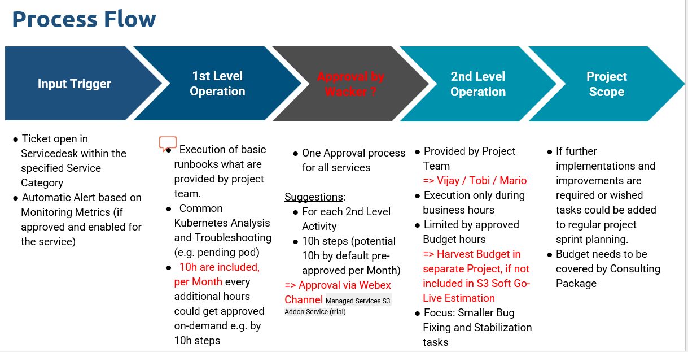

# Wacker Addon Support #

As per the current agreement with Wacker we are in trial-period and only S3 support is in the scope

# S3 Addon-Support
- Includes all services currently in development phase
- Each Services Trial Phase is limited to 6 Month
  - Needs after 3 Month execution an alignment check about follow up target service metrics and pricing (mandatory)
  - Can be prolonged only if both parties agree in written form
- SLAs
  - Response Time (see Wacker_Contract section 3.1)
  - No additional SLA’s
- Operation based on T&M
  - 1,5x of day rate applies if the services is not developed by Kubermatic (external service)
  - 10h per Month Runbook Executions and Basic Analytics are included (for all active services)
       - Customer Approval for additional hours needed (e.g. per 10h step)
       - Unused hours won’t be transferred
  - 2nd Level Operation (if provided by Kubermatic PS Project Team)
       - Will only get provided during business hours
       - Customer Approval required  (Threshold could be defined, e.g 3h are auto approved)

# Addon-Services - FAQs

- Automatic Alerting and Monitoring
   - Technical Integration is an must have to get experiences about later fully managed operation
   - Automatic Alerts could trigger basic Runbook execution & analysis
   - Alerts should get improved during this trial phase
- User Cluster MLA is provided
   - Minio Dashboard
   - Loki Logs
   - Prometheus metrics / Dashboards via Grafana
- Collect Information => Improve Operation for the Managed Service later
   - Create Runbooks out of the faced problems

# Process Flow

# Runbooks

